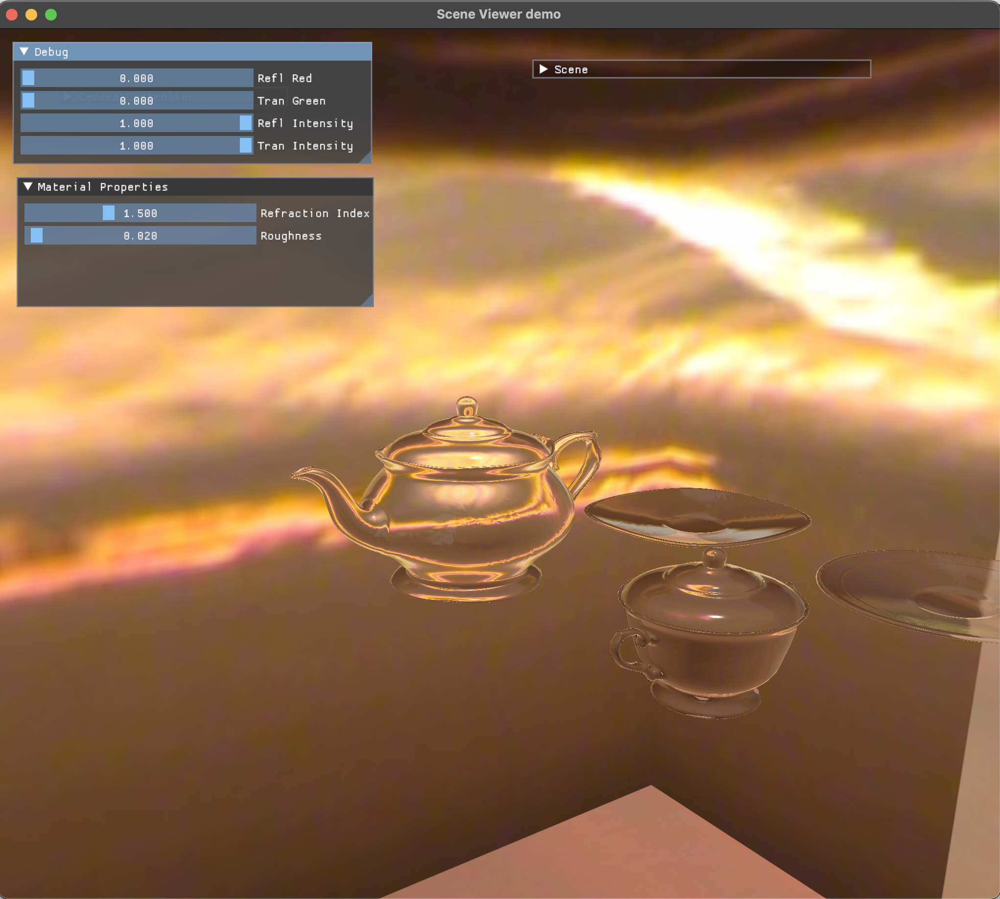

# Glass Refraction Approximation using BSDF

This project implements **refraction through glass** using **Physically Based Rendering (PBR)** principles and a **Bidirectional Scattering Distribution Function (BSDF)** for **smooth dielectric materials** like glass.

Despite using **rasterization**, which limits physical accuracy, the project successfully achieves a visually plausible approximation of glass refraction—suitable for stylized rendering and educational purposes.

---

## ⚙️ Settings and GUI Features

### 🧪 Material Properties Window

Allows real-time tweaking of glass parameters:

- **Refraction Index**  
  Controls how much light bends when passing through the material. Default: `1.5` (glass)  

- **Roughness**  
  Describes the smoothness of the surface. Affects how specular reflection is perceived. Default: `0.01` (smooth)  

### 🐞 Debug Window

Useful for inspecting transmission and reflection interactions:

- **Tran Green**: Highlights transmission in green
- **Refl Red**: Highlights reflection in red
- **Tran Intensity**: Adjusts transmission visibility from 0% to 100%

---

## 💡 Implementation Notes

- **BSDF Model**: Implemented for smooth dielectrics using refraction principles from _Physically Based Rendering_ [8].
- **Rendering**: Based on **rasterization**, which simplifies how light interactions are computed.
- **Limitations**:
  - Treats objects as **solid** rather than **hollow** (e.g. teapots).
  - Approximates refraction using only view direction, not full light integration (i.e., lacks full hemisphere sampling).
  - Reflected/transmitted rays don't account for internal glass interfaces.

---

## 📸 Results and Observations

- Refraction appears **plausible**, especially on convex surfaces like teapots and cups.
- High refraction indices increase light bending, often causing a **mirrored** look due to surface normals.
- Lowering the refraction index removes mirroring artifacts.
- The implementation provides a **stylized yet credible** illusion of glass refraction.

---

## 🏁 Conclusion

This project offers an accessible and flexible tool to simulate glass refraction through rasterization. While physically simplified, it provides valuable insight into light behavior and material modeling using PBR techniques.

Ideal for:
- Artistic experimentation
- Educational demonstrations
- Rapid prototyping of refractive effects

---

This project is based on Exercise 8 from the Graphics Programming course at the IT University of Copenhagen (ITU). It builds upon and extends the foundational work introduced in that course.
